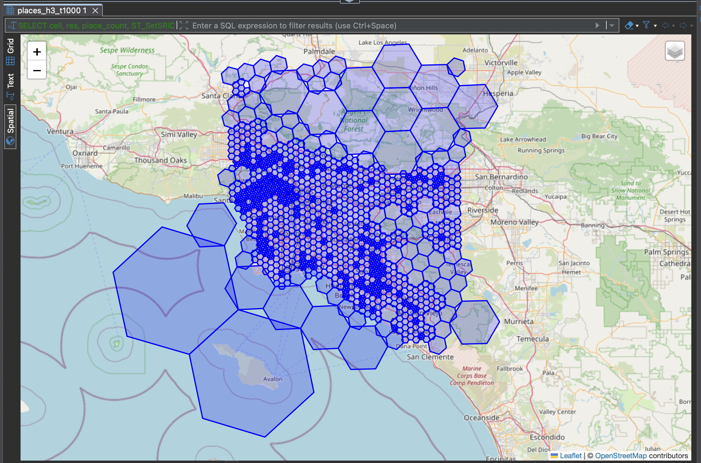
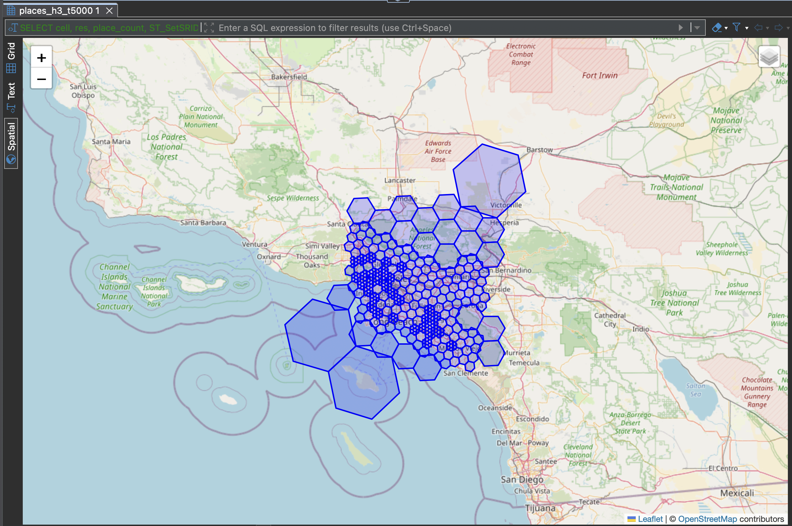
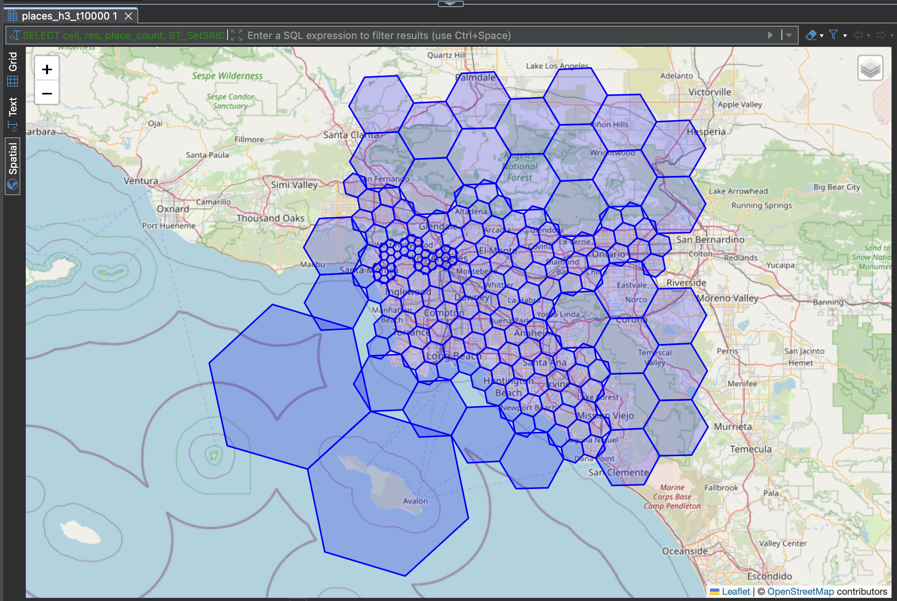
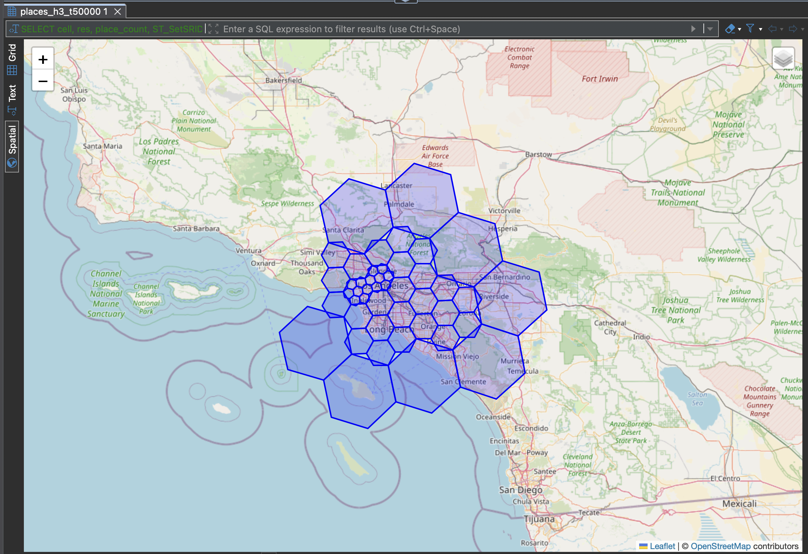
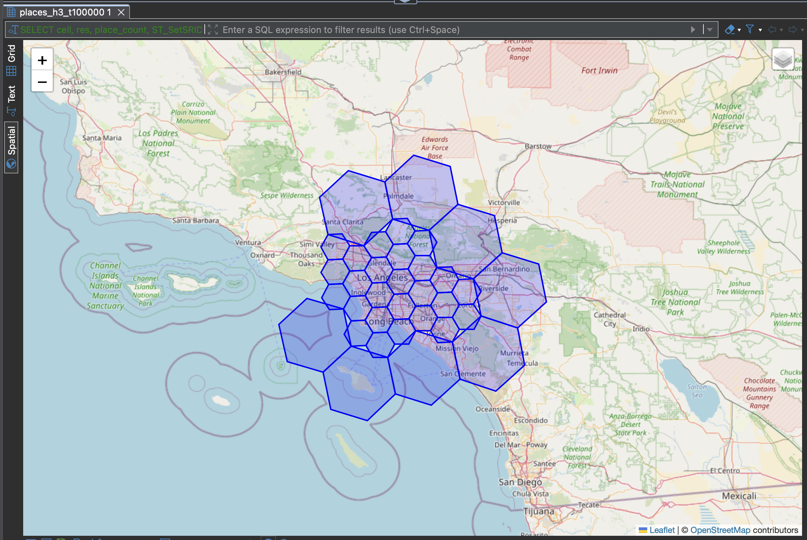

# Benchmark Results

Generated: 2026-03-19 04:23:39

## Screenshots (adaptive frontier output)

Threshold = **1,000**

Threshold = **5,000**

Threshold = **10,000**

Threshold = **50,000**

Threshold = **100,000**

## 1000

### view_drop (8.0ms)

_no output_

### view_create_view (189117.8ms)

_no output_

### view_count (14.2ms)

| total_cells |
| ----------- |
| 308074      |

### by_resolution (35.6ms)

| res | cells | places   | avg_per_cell | min_per_cell | max_per_cell |
| --- | ----- | -------- | ------------ | ------------ | ------------ |
| 1   | 525   | 50231    | 96           | 3            | 984          |
| 2   | 1116  | 222065   | 199          | 1            | 993          |
| 3   | 4008  | 792255   | 198          | 1            | 1000         |
| 4   | 14304 | 3531626  | 247          | 1            | 1000         |
| 5   | 43867 | 9984078  | 228          | 1            | 1000         |
| 6   | 65206 | 13583271 | 208          | 1            | 1000         |
| 7   | 87067 | 22271480 | 256          | 1            | 1000         |
| 8   | 70154 | 17216189 | 245          | 1            | 1000         |
| 9   | 20549 | 4547569  | 221          | 1            | 1000         |
| 10  | 1278  | 245975   | 192          | 1            | 2322         |

### deciles (97.4ms)

| decile | cells | min_count | avg_count | max_count | total_places |
| ------ | ----- | --------- | --------- | --------- | ------------ |
| 1      | 30808 | 1         | 5         | 12        | 165450       |
| 2      | 30808 | 12        | 23        | 35        | 710011       |
| 3      | 30808 | 35        | 50        | 67        | 1555191      |
| 4      | 30808 | 67        | 86        | 107       | 2649256      |
| 5      | 30807 | 107       | 130       | 155       | 4006832      |
| 6      | 30807 | 155       | 184       | 215       | 5656837      |
| 7      | 30807 | 215       | 252       | 294       | 7756889      |
| 8      | 30807 | 294       | 347       | 410       | 10700973     |
| 9      | 30807 | 410       | 498       | 605       | 15349823     |
| 10     | 30807 | 605       | 776       | 2322      | 23893477     |

### totals (71.9ms)

| total_cells | total_places | avg | stddev | min | percentiles                                | max  | single_place_cells |
| ----------- | ------------ | --- | ------ | --- | ------------------------------------------ | ---- | ------------------ |
| 308074      | 72444739     | 235 | 237    | 1   | [12, 35, 67, 107, 155, 215, 294, 410, 605] | 2322 | 5127               |

### top_dense (2923.3ms)

| cell            | res | place_count | center                                    |
| --------------- | --- | ----------- | ----------------------------------------- |
| 8a194ad32437fff | 10  | 2322        | (-0.1230020786232471,51.5144038355684)    |
| 8a194ad36aaffff | 10  | 2110        | (-0.08927283286843347,51.527691391639046) |
| 8a2ca2b4cc1ffff | 10  | 2100        | (44.393401069873654,33.34208863054742)    |
| 8a424d06ead7fff | 10  | 2072        | (74.34352218863413,31.549468858681248)    |
| 8a42e443202ffff | 10  | 2012        | (67.0100843098888,24.86029125441343)      |
| 8a194ad36a47fff | 10  | 1308        | (-0.08344054682899417,51.5256872434738)   |
| 8a65846a90dffff | 10  | 1212        | (104.8785055697636,11.552412799864026)    |
| 8a279954e14ffff | 10  | 1203        | (-106.95540090058101,44.797465451525)     |
| 8a65846aba6ffff | 10  | 1202        | (104.87888290925663,11.562452772753419)   |
| 8a3cf1760ca7fff | 10  | 1165        | (90.39909760607412,23.713618697973313)    |
| 8a3cf176545ffff | 10  | 1067        | (90.41521152498602,23.730101656353945)    |
| 882e604cd7fffff | 8   | 1000        | (136.7567898068274,35.41138413602307)     |
| 848f4adffffffff | 4   | 1000        | (-75.77992957858312,-9.205683242881493)   |
| 881f607741fffff | 8   | 1000        | (24.11987796321169,56.94676697752714)     |
| 8818659441fffff | 8   | 1000        | (1.1011430778109677,49.441168950198275)   |
| 87425a6f5ffffff | 7   | 1000        | (72.98096901537838,26.26383896137111)     |
| 892b9bc7397ffff | 9   | 1000        | (-79.39059710668367,43.67067010016688)    |
| 8726de6b0ffffff | 7   | 1000        | (-101.92750262317675,33.539962134676614)  |
| 862aa3777ffffff | 6   | 1000        | (-78.3771771003647,40.446902223868605)    |
| 873951c05ffffff | 7   | 1000        | (1.3054345368245406,38.98584846577678)    |

### area_coverage (304.9ms)

| res | cells | places   | total_area_km2 | pct_earth |
| --- | ----- | -------- | -------------- | --------- |
| 1   | 525   | 50231    | 317301345      | 62.22     |
| 2   | 1116  | 222065   | 97068065       | 19.03     |
| 3   | 4008  | 792255   | 49732950       | 9.75      |
| 4   | 14304 | 3531626  | 25630389       | 5.03      |
| 5   | 43867 | 9984078  | 11176482       | 2.19      |
| 6   | 65206 | 13583271 | 2338809        | 0.46      |
| 7   | 87067 | 22271480 | 447751         | 0.09      |
| 8   | 70154 | 17216189 | 52866          | 0.01      |
| 9   | 20549 | 4547569  | 2200           | 0.00      |
| 10  | 1278  | 245975   | 20             | 0.00      |

### gini (192.6ms)

| gini    |
| ------- |
| -0.5289 |

### overlapping_cells (451.4ms)

| overlapping_pairs |
| ----------------- |
| 0                 |

## 10000

### view_drop (6.8ms)

_no output_

### view_create_view (185359.8ms)

_no output_

### view_count (2.8ms)

| total_cells |
| ----------- |
| 32668       |

### by_resolution (13.9ms)

| res | cells | places   | avg_per_cell | min_per_cell | max_per_cell |
| --- | ----- | -------- | ------------ | ------------ | ------------ |
| 1   | 640   | 569117   | 889          | 3            | 9915         |
| 2   | 794   | 1504017  | 1894         | 1            | 10000        |
| 3   | 2897  | 6582743  | 2272         | 1            | 9999         |
| 4   | 7769  | 18307184 | 2356         | 1            | 9999         |
| 5   | 8605  | 18100924 | 2104         | 1            | 9998         |
| 6   | 7441  | 17190258 | 2310         | 1            | 9974         |
| 7   | 3879  | 8912671  | 2298         | 1            | 9961         |
| 8   | 636   | 1266884  | 1992         | 1            | 9898         |
| 9   | 7     | 10941    | 1563         | 343          | 2177         |

### deciles (10.6ms)

| decile | cells | min_count | avg_count | max_count | total_places |
| ------ | ----- | --------- | --------- | --------- | ------------ |
| 1      | 3267  | 1         | 15        | 47        | 47559        |
| 2      | 3267  | 47        | 137       | 254       | 447060       |
| 3      | 3267  | 254       | 401       | 560       | 1308816      |
| 4      | 3267  | 560       | 749       | 948       | 2446951      |
| 5      | 3267  | 949       | 1173      | 1410      | 3831346      |
| 6      | 3267  | 1410      | 1683      | 1983      | 5499525      |
| 7      | 3267  | 1984      | 2338      | 2736      | 7636835      |
| 8      | 3267  | 2736      | 3264      | 3864      | 10664830     |
| 9      | 3266  | 3865      | 4769      | 5889      | 15575491     |
| 10     | 3266  | 5890      | 7650      | 10000     | 24986326     |

### totals (11.2ms)

| total_cells | total_places | avg  | stddev | min | percentiles                                       | max   | single_place_cells |
| ----------- | ------------ | ---- | ------ | --- | ------------------------------------------------- | ----- | ------------------ |
| 32668       | 72444739     | 2218 | 2347   | 1   | [47, 254, 560, 948, 1410, 1983, 2736, 3864, 5888] | 10000 | 411                |

### top_dense (270.2ms)

| cell            | res | place_count | center                                   |
| --------------- | --- | ----------- | ---------------------------------------- |
| 82452ffffffffff | 2   | 10000       | (-89.84967244363287,17.829589029313365)  |
| 831ef6fffffffff | 3   | 9999        | (18.317858075080892,43.20812466167876)   |
| 8410a81ffffffff | 4   | 9999        | (49.35807227257841,55.74170303937327)    |
| 8529a017fffffff | 5   | 9998        | (-117.41594469681507,33.88323056114871)  |
| 852e74abfffffff | 5   | 9997        | (139.0527468646227,36.40957014324111)    |
| 841e35bffffffff | 4   | 9991        | (15.365651426246895,50.685221784628325)  |
| 828b57fffffffff | 2   | 9990        | (-66.69305876976581,-10.819682062872559) |
| 852aac97fffffff | 5   | 9990        | (-75.31246577034807,40.16324703706922)   |
| 85489c17fffffff | 5   | 9989        | (-98.71418700253291,29.47954380078891)   |
| 833e64fffffffff | 3   | 9982        | (31.485126372283784,31.71388388942357)   |
| 83a802fffffffff | 3   | 9981        | (-48.72353854300753,-23.59842837206024)  |
| 85268ccbfffffff | 5   | 9976        | (-105.08448696984603,39.57816092287579)  |
| 822807fffffffff | 2   | 9976        | (-124.76072993368852,40.13171663764596)  |
| 85194dbbfffffff | 5   | 9975        | (3.6063070470018785,51.05835054683531)   |
| 866914d57ffffff | 6   | 9974        | (109.18524639601992,12.212128115034066)  |
| 842da27ffffffff | 4   | 9973        | (35.78107349954961,34.10010356191247)    |
| 851eda67fffffff | 5   | 9971        | (23.803056351469802,37.856254183277294)  |
| 85445c07fffffff | 5   | 9968        | (-90.15418839577104,32.317374300169924)  |
| 843f623ffffffff | 4   | 9967        | (27.615812003740828,36.94591427279116)   |
| 852c01dbfffffff | 5   | 9963        | (44.5521603081682,40.120317290051226)    |

### area_coverage (67.0ms)

| res | cells | places   | total_area_km2 | pct_earth |
| --- | ----- | -------- | -------------- | --------- |
| 1   | 640   | 569117   | 386988516      | 75.88     |
| 2   | 794   | 1504017  | 68912136       | 13.51     |
| 3   | 2897  | 6582743  | 36295994       | 7.12      |
| 4   | 7769  | 18307184 | 13909339       | 2.73      |
| 5   | 8605  | 18100924 | 2167548        | 0.43      |
| 6   | 7441  | 17190258 | 269511         | 0.05      |
| 7   | 3879  | 8912671  | 20536          | 0.00      |
| 8   | 636   | 1266884  | 479            | 0.00      |
| 9   | 7     | 10941    | 1              | 0.00      |

### gini (23.2ms)

| gini    |
| ------- |
| -0.5517 |

### overlapping_cells (132.4ms)

| overlapping_pairs |
| ----------------- |
| 0                 |

## 20000

### view_drop (7.2ms)

_no output_

### view_create_view (183634.2ms)

_no output_

### view_count (2.2ms)

| total_cells |
| ----------- |
| 16953       |

### by_resolution (11.4ms)

| res | cells | places   | avg_per_cell | min_per_cell | max_per_cell |
| --- | ----- | -------- | ------------ | ------------ | ------------ |
| 1   | 664   | 922628   | 1390         | 3            | 19497        |
| 2   | 762   | 3107474  | 4078         | 1            | 19740        |
| 3   | 2492  | 12039474 | 4831         | 1            | 19938        |
| 4   | 4991  | 21570037 | 4322         | 1            | 19946        |
| 5   | 4175  | 17491239 | 4190         | 1            | 19902        |
| 6   | 2857  | 12993914 | 4548         | 1            | 19906        |
| 7   | 970   | 4168572  | 4297         | 1            | 19640        |
| 8   | 42    | 151401   | 3605         | 190          | 9898         |

### deciles (6.6ms)

| decile | cells | min_count | avg_count | max_count | total_places |
| ------ | ----- | --------- | --------- | --------- | ------------ |
| 1      | 1696  | 1         | 14        | 47        | 23061        |
| 2      | 1696  | 47        | 184       | 380       | 312040       |
| 3      | 1696  | 381       | 649       | 964       | 1101381      |
| 4      | 1695  | 964       | 1322      | 1711      | 2241319      |
| 5      | 1695  | 1713      | 2140      | 2581      | 3626597      |
| 6      | 1695  | 2581      | 3092      | 3647      | 5240324      |
| 7      | 1695  | 3648      | 4353      | 5159      | 7378697      |
| 8      | 1695  | 5159      | 6258      | 7541      | 10606944     |
| 9      | 1695  | 7541      | 9411      | 11716     | 15952021     |
| 10     | 1695  | 11717     | 15317     | 19946     | 25962355     |

### totals (7.5ms)

| total_cells | total_places | avg  | stddev | min | percentiles                                         | max   | single_place_cells |
| ----------- | ------------ | ---- | ------ | --- | --------------------------------------------------- | ----- | ------------------ |
| 16953       | 72444739     | 4273 | 4719   | 1   | [47, 380, 963, 1711, 2580, 3647, 5158, 7541, 11715] | 19946 | 213                |

### top_dense (137.6ms)

| cell            | res | place_count | center                                   |
| --------------- | --- | ----------- | ---------------------------------------- |
| 848cab7ffffffff | 4   | 19946       | (104.74712769213322,-2.926854494784646)  |
| 842f5bbffffffff | 4   | 19946       | (138.73473991557123,35.223601860768795)  |
| 832ad2fffffffff | 3   | 19938       | (-79.3905642003005,34.4765362738182)     |
| 841f8c3ffffffff | 4   | 19928       | (10.675575745387306,48.239716661730206)  |
| 841f831ffffffff | 4   | 19924       | (7.8260857987572985,47.19105557893868)   |
| 841f189ffffffff | 4   | 19906       | (12.92286265772195,52.391530823236835)   |
| 862a134d7ffffff | 6   | 19906       | (-75.16417687008371,39.930176347179064)  |
| 842e689ffffffff | 4   | 19903       | (133.94392664709426,34.74263022860926)   |
| 851e24abfffffff | 5   | 19902       | (16.913241119740594,52.34065139402345)   |
| 85bc1b67fffffff | 5   | 19897       | (31.030007781893683,-29.813345651621795) |
| 8548c6c7fffffff | 5   | 19890       | (-106.36157373695325,31.780744569589952) |
| 831edefffffffff | 3   | 19887       | (22.81456294883287,39.30212000243279)    |
| 851e21b3fffffff | 5   | 19879       | (19.539136742297657,51.78238673342456)   |
| 8343a0fffffffff | 3   | 19875       | (53.98571304072621,24.347785595405277)   |
| 8444a8dffffffff | 4   | 19873       | (-80.38742067464112,27.32814994798577)   |
| 85801047fffffff | 5   | 19869       | (-38.64253168987131,-3.8287134931861475) |
| 8420e61ffffffff | 4   | 19854       | (76.9754243743618,43.34715901494329)     |
| 842a301ffffffff | 4   | 19848       | (-70.79105885228907,42.7272079019614)    |
| 83182efffffffff | 3   | 19844       | (-8.182654962995928,53.08430256851138)   |
| 861ec465fffffff | 6   | 19837       | (23.33133004896218,42.704116516705454)   |

### area_coverage (35.5ms)

| res | cells | places   | total_area_km2 | pct_earth |
| --- | ----- | -------- | -------------- | --------- |
| 1   | 664   | 922628   | 401141739      | 78.66     |
| 2   | 762   | 3107474  | 66539664       | 13.05     |
| 3   | 2492  | 12039474 | 31363702       | 6.15      |
| 4   | 4991  | 21570037 | 8919785        | 1.75      |
| 5   | 4175  | 17491239 | 1051735        | 0.21      |
| 6   | 2857  | 12993914 | 105202         | 0.02      |
| 7   | 970   | 4168572  | 5103           | 0.00      |
| 8   | 42    | 151401   | 31             | 0.00      |

### gini (12.6ms)

| gini    |
| ------- |
| -0.5701 |

### overlapping_cells (104.5ms)

| overlapping_pairs |
| ----------------- |
| 0                 |

## 50000

### view_drop (7.1ms)

_no output_

### view_create_view (190816.3ms)

_no output_

### view_count (1.2ms)

| total_cells |
| ----------- |
| 7259        |

### by_resolution (10.2ms)

| res | cells | places   | avg_per_cell | min_per_cell | max_per_cell |
| --- | ----- | -------- | ------------ | ------------ | ------------ |
| 1   | 701   | 2144332  | 3059         | 3            | 48291        |
| 2   | 674   | 7140451  | 10594        | 1            | 49969        |
| 3   | 1825  | 21847059 | 11971        | 1            | 49986        |
| 4   | 2131  | 21229123 | 9962         | 1            | 49981        |
| 5   | 1257  | 13047936 | 10380        | 1            | 49851        |
| 6   | 573   | 6134230  | 10705        | 1            | 49868        |
| 7   | 98    | 901608   | 9200         | 1736         | 33354        |

### deciles (3.5ms)

| decile | cells | min_count | avg_count | max_count | total_places |
| ------ | ----- | --------- | --------- | --------- | ------------ |
| 1      | 726   | 1         | 12        | 31        | 8422         |
| 2      | 726   | 31        | 176       | 467       | 127741       |
| 3      | 726   | 467       | 1026      | 1730      | 745229       |
| 4      | 726   | 1734      | 2490      | 3274      | 1808012      |
| 5      | 726   | 3275      | 4329      | 5527      | 3142833      |
| 6      | 726   | 5536      | 6825      | 8193      | 4955034      |
| 7      | 726   | 8194      | 10025     | 12099     | 7277817      |
| 8      | 726   | 12102     | 14845     | 17817     | 10777279     |
| 9      | 726   | 17824     | 22553     | 28433     | 16373236     |
| 10     | 725   | 28441     | 37557     | 49986     | 27229136     |

### totals (4.9ms)

| total_cells | total_places | avg  | stddev | min | percentiles                                            | max   | single_place_cells |
| ----------- | ------------ | ---- | ------ | --- | ------------------------------------------------------ | ----- | ------------------ |
| 7259        | 72444739     | 9980 | 11695  | 1   | [31, 467, 1732, 3274, 5527, 8192, 12098, 17812, 28423] | 49986 | 61                 |

### top_dense (60.1ms)

| cell            | res | place_count | center                                   |
| --------------- | --- | ----------- | ---------------------------------------- |
| 832e75fffffffff | 3   | 49986       | (138.1008931762814,36.30776913926705)    |
| 842aaabffffffff | 4   | 49981       | (-77.4403841984819,38.782955045872285)   |
| 826d77fffffffff | 2   | 49969       | (-89.87222601005038,12.810542035980543)  |
| 8364b6fffffffff | 3   | 49894       | (102.80826957143228,17.78342616428796)   |
| 8665b566fffffff | 6   | 49868       | (106.635263680467,10.766471501886873)    |
| 852d3333fffffff | 5   | 49851       | (32.8322537710893,39.868723117548974)    |
| 85390ca3fffffff | 5   | 49730       | (-3.6176032466282675,40.372540582165755) |
| 831e21fffffffff | 3   | 49634       | (19.161752451207914,51.40961705163096)   |
| 834980fffffffff | 3   | 49553       | (-100.93336342336237,19.804141549076665) |
| 84446c1ffffffff | 4   | 49477       | (-95.07759249333691,29.645425762053556)  |
| 8419435ffffffff | 4   | 49475       | (-0.9874220544607005,52.83832754582589)  |
| 843969bffffffff | 4   | 49406       | (7.1973241633940805,43.70676082549881)   |
| 85be8d13fffffff | 5   | 49364       | (153.04759793439297,-27.441629204467564) |
| 823c07fffffffff | 2   | 49352       | (86.00509004642792,28.50830365117255)    |
| 8549958ffffffff | 5   | 49326       | (-99.00339729552533,19.35841729283529)   |
| 832758fffffffff | 3   | 49298       | (-89.41999684758623,43.121506656014084)  |
| 832668fffffffff | 3   | 49180       | (-86.23776716234067,38.064363420060374)  |
| 832681fffffffff | 3   | 49161       | (-105.78175892887282,39.93982241604209)  |
| 841fae7ffffffff | 4   | 48944       | (8.42123275014468,49.54466050816457)     |
| 822887fffffffff | 2   | 48826       | (-116.0363455113987,44.400305679619834)  |

### area_coverage (16.7ms)

| res | cells | places   | total_area_km2 | pct_earth |
| --- | ----- | -------- | -------------- | --------- |
| 1   | 701   | 2144332  | 423595351      | 83.06     |
| 2   | 674   | 7140451  | 59049758       | 11.58     |
| 3   | 1825  | 21847059 | 22962284       | 4.50      |
| 4   | 2131  | 21229123 | 3767695        | 0.74      |
| 5   | 1257  | 13047936 | 318859         | 0.06      |
| 6   | 573   | 6134230  | 21152          | 0.00      |
| 7   | 98    | 901608   | 505            | 0.00      |

### gini (7.6ms)

| gini    |
| ------- |
| -0.5978 |

### overlapping_cells (90.1ms)

| overlapping_pairs |
| ----------------- |
| 0                 |

## 100000

### view_drop (10.1ms)

_no output_

### view_create_view (184963.9ms)

_no output_

### view_count (1.0ms)

| total_cells |
| ----------- |
| 3881        |

### by_resolution (9.3ms)

| res | cells | places   | avg_per_cell | min_per_cell | max_per_cell |
| --- | ----- | -------- | ------------ | ------------ | ------------ |
| 1   | 737   | 4758837  | 6457         | 3            | 98834        |
| 2   | 548   | 13555589 | 24736        | 1            | 99939        |
| 3   | 1163  | 26993302 | 23210        | 1            | 99734        |
| 4   | 852   | 15705826 | 18434        | 1            | 99499        |
| 5   | 455   | 8830726  | 19408        | 1            | 97985        |
| 6   | 126   | 2600459  | 20639        | 100          | 95740        |

### deciles (2.6ms)

| decile | cells | min_count | avg_count | max_count | total_places |
| ------ | ----- | --------- | --------- | --------- | ------------ |
| 1      | 389   | 1         | 10        | 20        | 3884         |
| 2      | 388   | 21        | 64        | 186       | 24649        |
| 3      | 388   | 192       | 900       | 1944      | 349064       |
| 4      | 388   | 1951      | 3235      | 4820      | 1255328      |
| 5      | 388   | 4826      | 6903      | 8793      | 2678505      |
| 6      | 388   | 8840      | 11483     | 14426     | 4455274      |
| 7      | 388   | 14430     | 17835     | 21849     | 6919989      |
| 8      | 388   | 21866     | 27666     | 34066     | 10734322     |
| 9      | 388   | 34082     | 43537     | 55232     | 16892514     |
| 10     | 388   | 55326     | 75080     | 99939     | 29131210     |

### totals (3.8ms)

| total_cells | total_places | avg   | stddev | min | percentiles                                             | max   | single_place_cells |
| ----------- | ------------ | ----- | ------ | --- | ------------------------------------------------------- | ----- | ------------------ |
| 3881        | 72444739     | 18667 | 23587  | 1   | [20, 186, 1944, 4820, 8793, 14426, 21849, 34066, 55232] | 99939 | 25                 |

### top_dense (37.0ms)

| cell            | res | place_count | center                                   |
| --------------- | --- | ----------- | ---------------------------------------- |
| 822e2ffffffffff | 2   | 99939       | (141.659652169662,37.16086534140227)     |
| 834983fffffffff | 3   | 99734       | (-100.7955926847747,20.96509000686741)   |
| 82a80ffffffffff | 2   | 99576       | (-51.76504674253373,-21.805407563412665) |
| 841e833ffffffff | 4   | 99499       | (14.325762890483606,41.02505571220932)   |
| 826d2ffffffffff | 2   | 99451       | (-91.33436831043265,15.225535960073875)  |
| 828117fffffffff | 2   | 99388       | (-39.06242775710285,-12.20635840412721)  |
| 84bcc35ffffffff | 4   | 99353       | (28.015502699830062,-25.995011157073456) |
| 821e67fffffffff | 2   | 99344       | (29.55377984004356,51.068829208096865)   |
| 831f16fffffffff | 3   | 99078       | (7.038924728207194,52.340083454862544)   |
| 84195c1ffffffff | 4   | 98978       | (-2.0025194963388606,52.65747225738179)  |
| 832696fffffffff | 3   | 98946       | (-112.18622246107131,40.7169635951468)   |
| 81ad3ffffffffff | 1   | 98834       | (14.257639692856076,-32.44689440288129)  |
| 8249b7fffffffff | 2   | 98358       | (-99.12346288238514,17.29338915146101)   |
| 821127fffffffff | 2   | 98288       | (26.534522805834147,61.43268145278825)   |
| 8395a4fffffffff | 3   | 98282       | (115.58599225085781,-8.786089861031739)  |
| 852e6107fffffff | 5   | 97985       | (135.486641772703,34.64382540477158)     |
| 832832fffffffff | 3   | 97916       | (-121.0099181112191,38.823870326980895)  |
| 821847fffffffff | 2   | 97794       | (-3.564659083122459,46.928045893737306)  |
| 82a82ffffffffff | 2   | 97733       | (-52.88501702942306,-24.329006531417868) |
| 822af7fffffffff | 2   | 97677       | (-75.6469990705627,36.38572326218801)    |

### area_coverage (10.9ms)

| res | cells | places   | total_area_km2 | pct_earth |
| --- | ----- | -------- | -------------- | --------- |
| 1   | 737   | 4758837  | 445486270      | 87.35     |
| 2   | 548   | 13555589 | 48182254       | 9.45      |
| 3   | 1163  | 26993302 | 14555300       | 2.85      |
| 4   | 852   | 15705826 | 1513659        | 0.30      |
| 5   | 455   | 8830726  | 117746         | 0.02      |
| 6   | 126   | 2600459  | 4656           | 0.00      |

### gini (5.0ms)

| gini    |
| ------- |
| -0.6313 |

### overlapping_cells (84.0ms)

| overlapping_pairs |
| ----------------- |
| 0                 |

